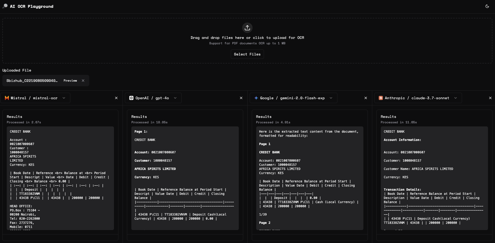

# AI OCR Playground

Platform for comparing and evaluating state-of-the-art OCR 
capabilities across multiple AI models. Built with modern web 
technologies and a focus on developer experience.



## Features

- Support for multiple AI models:
  - Mistral AI (mistral-ocr)
  - OpenAI (gpt-4o)
  - Google (gemini-2.0-flash-exp)
  - Anthropic (claude-3.7-sonnet)
- PDF document support
- Real-time processing
- Side-by-side comparison
- Dark mode support

## Getting Started

1. Clone the repository
2. Install dependencies:
   ```bash
   npm install
   ```
3. Set up your environment variables:
   ```env
   MISTRAL_API_KEY=
   OPENAI_API_KEY=
   GOOGLE_API_KEY=
   ANTHROPIC_API_KEY=
   ```
4. Run the development server:
   ```bash
   npm run dev
   ```

## Usage

1. Upload a PDF document (up to 1 MB)
2. Select the AI models you want to compare
3. View the results side by side
4. Compare processing time and accuracy

## Tech Stack

- Next.js 14
- TypeScript
- Tailwind CSS
- shadcn/ui
- Vercel AI SDK

## Architecture

### Frontend Stack
- **Framework**: Next.js 14 with App Router and Typescript
- **UI**: Custom components built with Radix UI primitives and Tailwind CSS
- **State Management**: React Hooks with custom abstractions
- **Typography**: Space Mono for enhanced technical aesthetics
- **Styling**: Tailwind CSS with CSS Variables for dynamic theming

### AI Integration
- **Mistral AI**: Native OCR API integration with document processing capabilities
- **OpenAI**: GPT-4 Vision with optimized document understanding
- **Google AI**: Gemini 2.0 Flash for high-performance document analysis
- **Parallel Processing**: Concurrent model execution
- **Streaming**: Real-time results using Vercel AI SDK

### Key Features
- **Multi-Model Comparison**: Simultaneous document processing across different AI models
- **Real-time Processing**: Asynchronous document handling with progress tracking
- **PDF Preview**: Native PDF rendering with iframe-based preview
- **Responsive Design**: Adaptive grid layout supporting up to 4 concurrent models
- **Dark Mode**: System-aware theme switching with smooth transitions

### Performance Optimizations
- **Lazy Loading**: Dynamic imports for heavy components
- **Caching**: Results caching for repeated document analysis
- **Type Safety**: Full TypeScript implementation with strict type checking
- **Error Boundaries**: Graceful error handling at component level

## Technical Implementation

### Model Configuration
- Configurable context windows
- Provider-specific optimizations
- Extensible model registry

## Development

\`\`\`bash
# Install dependencies
npm install

# Set up environment variables
cp .env.example .env.local

# Run development server
npm run dev
\`\`\`

## Environment Variables
\`\`\`env
OPENAI_API_KEY=your_key
GOOGLE_API_KEY=your_key
MISTRAL_API_KEY=your_key
\`\`\`

## Future Enhancements
- [ ] Batch processing capabilities
- [ ] Result comparison analytics
- [ ] Custom model fine-tuning interface
- [ ] Export functionality for analysis

## License
MIT

---
Built with ❤️ using Next.js and Vercel AI SDK 